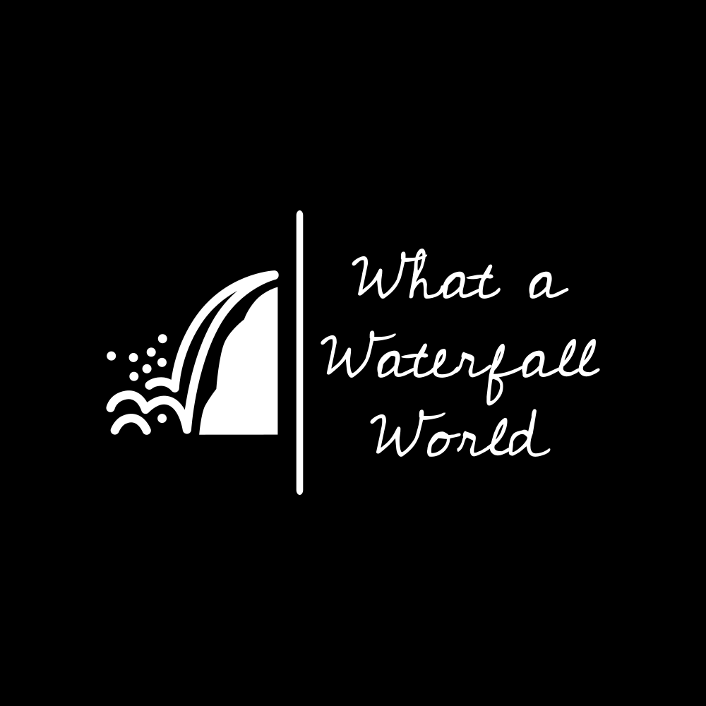

# What a Waterfall World

## Description
**What a Waterfall World** is a web application that allows users to explore and share information about waterfalls around the world. It features user authentication, waterfall management, reviews, and Google Maps integration. This project is built on a Node.js backend using Express, MongoDB, Handlebars, Bootstrap, and Cloudinary for image uploads.

## Instructions to Run This App on Your Computer
To run this application on your local machine, follow these steps:

### 1. Clone the Repository
```bash
git clone https://github.com/What-a-Waterfall-World/what-a-waterfall-world
```

### 2. Install Dependencies
Navigate to the project directory and install the required dependencies using npm:

```bash
cd what-a-waterfall-world
npm install
```

### 3. Set Up Environment Variables
Create a `.env` file in the project root directory and add the following environment variables:

- **DATABASE_URI**: Your MongoDB connection URI.
- **CLOUDINARY_CLOUD_NAME**: Your Cloudinary cloud name.
- **CLOUDINARY_API_KEY**: Your Cloudinary API key.
- **CLOUDINARY_API_SECRET**: Your Cloudinary API secret.
- **GOOGLE_MAPS_API_KEY**: Your Google Maps API key.

Ensure that you obtain API keys and credentials where required. You may need to create accounts on services like Cloudinary and Google Cloud to obtain API keys.

### 4. Seed the Database
To populate your MongoDB database with initial data, you can follow these steps:

1. Create a `seeds.js` file in your project directory (usually in the root folder).

2. Inside `seeds.js`, define the initial data you want to populate your MongoDB database with. For example, you might create some default waterfalls.

3. Use Mongoose for MongoDB to insert this data into your database.

4. After creating the `seeds.js` file and customizing it with the data you want to insert, run the seed script using the command:

   ```bash
   node bin/seeds.js
   ```

This will populate your database with the initial data.

### 5. Run the Application
Start the development server:

```bash
npm run dev
```

The application will be accessible in your browser at `http://localhost:3000`.

## Demo
You can access the deployed version of this project on [adaptable.io](https://whatawaterfallworld.adaptable.app/).
